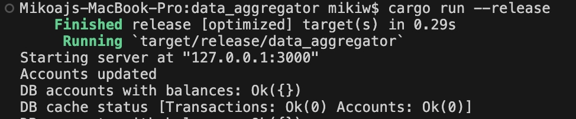
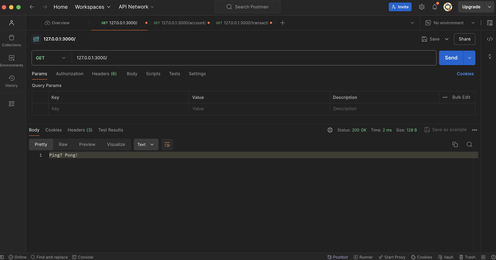
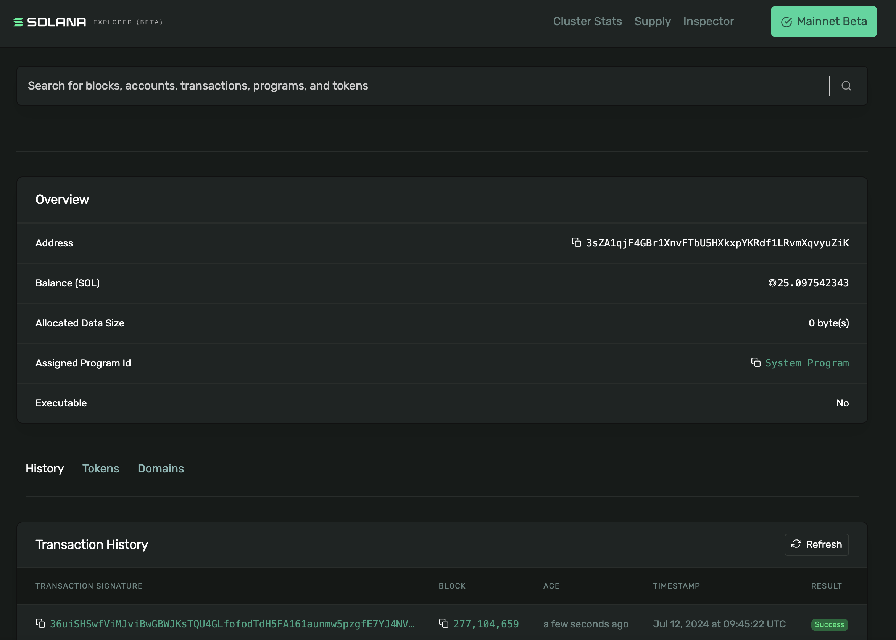
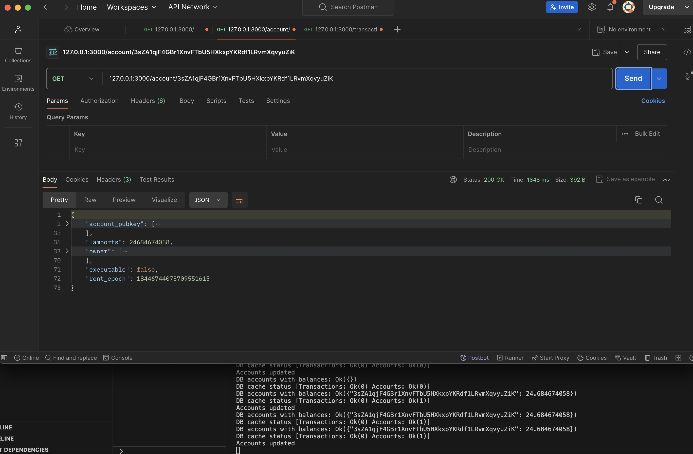
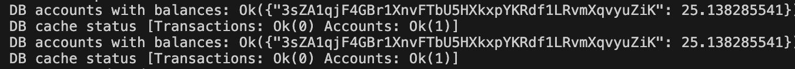
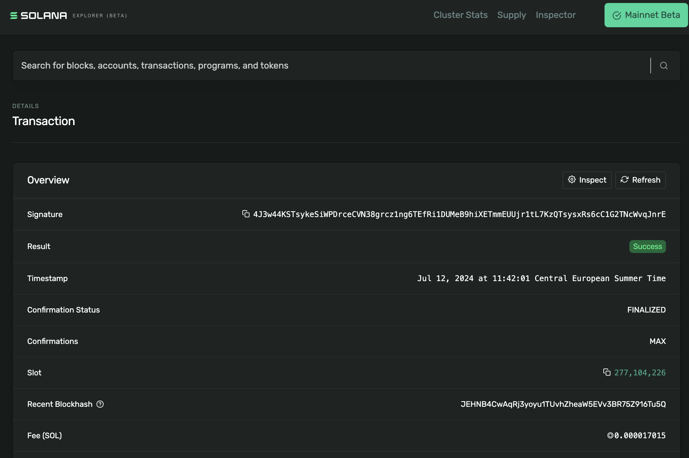
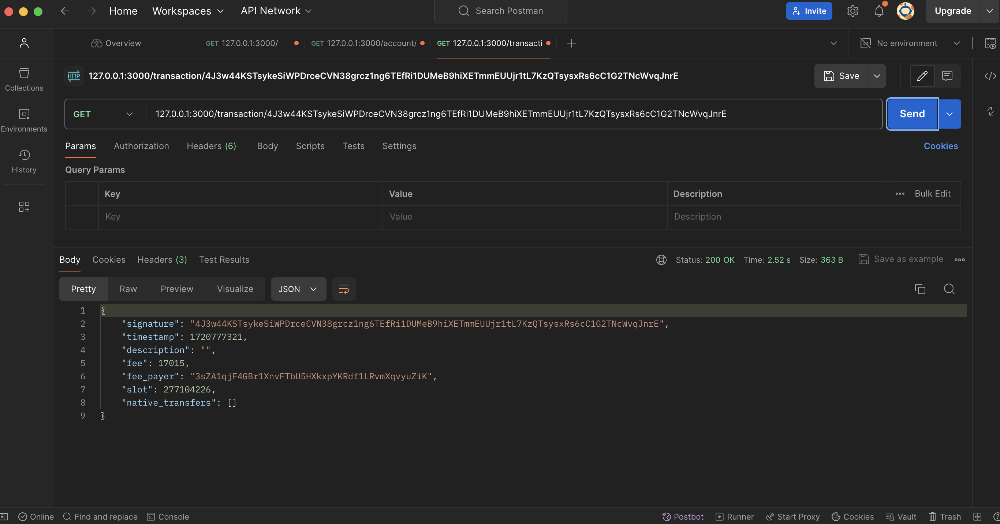
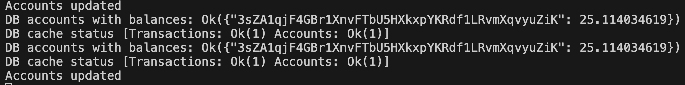

# Solana Data Aggregator
Solana Data Aggregator serves as a lightweight middleware layer that integrates Solana's RPC Nodes and APIs, such as [Helius](https://www.helius.dev/), with indoor API systems.

## Implementation
I chose to implement the server using the [axum](https://crates.io/crates/axum) framework for creating a RESTful API layer, leveraging my familiarity with it and its proven reliability.

The entry point for the program is the `main()` function, which executes the `run_server()` function. This function launches the [axum](https://crates.io/crates/axum) server and manages relevant background tasks:
- server_log(): Prints the server status every 3 seconds.
- server_monitor(): Updates tracked accounts with SOL balance every 6 seconds.

As a lightweight middleware API layer, our server fetches data from the [Helius API](https://www.helius.dev/) and stores it in a local memory database. The core business logic for that resides in the `impl Retrieval`.

While this approach is straightforward and convenient for now, future enhancements may involve implementing crawling mechanisms, such as fetching transaction data block by block or based on specific criteria, similar to block indexers. Since accepted transactions on Solana are immutable, the `server_monitor` background task focuses on updating account data.


To run the program, execute the following commands in your terminal:
```
cargo run
```
or
```
cargo run --release
```

After execution, the CLI will display the following messages:
```
Starting server at "127.0.0.1:3000"
Accounts updated
DB accounts with balances: Ok({})
DB cache status [Transactions: Ok(0) Accounts: Ok(0)]
```

Once the server is running, you can target three endpoints:

### Server testing endpoint

/
```
Get 127.0.0.1:3000
```

Response
```
"Ping? Pong!"
```

### Account fetching

/account/:account_id
```
Get 127.0.0.1:3000/account/GATaRyQr7hq52GQWq3TsCditpNhkgq5ad4EM14JoRMLu
```

Response
```
{"account_pubkey":[225,75,148,201,63,154,187,75,222,207,173,26,8,199,79,221,199,149,153,193,206,128,159,8,16,233,174,46,222,131,252,82],"lamports":1823520,"owner":[12,183,250,187,82,247,166,72,187,91,49,125,154,1,139,144,87,203,2,71,116,250,254,1,230,196,223,152,204,56,88,129],"executable":false,"rent_epoch":18446744073709551615}
```

### Transaction fetching

/transaction/:tx_signature
```
Get 127.0.0.1:3000/transaction/5XiFRQDYp31KxFQtJqqrjTduTZnGaEWffmv4941D34VsX2GpYavU69bpn1xwWtrcS7fE7D5KuXCjpqjQwLHHeifZ
```

Response
```
{"signature":"5XiFRQDYp31KxFQtJqqrjTduTZnGaEWffmv4941D34VsX2GpYavU69bpn1xwWtrcS7fE7D5KuXCjpqjQwLHHeifZ","timestamp":1720605742,"description":"","fee":5001,"fee_payer":"38tFiQmLwmzUHYiCrYKH4pumqWxpdaYvErUsJbmeSZus","slot":276738369,"native_transfers":[{"amount":2039280,"from_user_account":"71eXHafHQ5mDf4ZeA1FPKsKQFR32TMQsq3wukuwyTSDe","to_user_account":"38tFiQmLwmzUHYiCrYKH4pumqWxpdaYvErUsJbmeSZus"}]}
```

## Postman testing example

First, run the server in the terminal.


Check if the server is running.


Find an active Solana account on the mainnet, for example `3sZA1qjF4GBr1XnvFTbU5HXkxpYKRdf1LRvmXqvyuZiK`, and try to retrieve account data.


Since there is no account in the memory database, it should be fetched and stored in the memory database.


Wait for a while and check the updated balance in SOL; for an active account, the balance should change


Find a Solana transaction on the mainnet, for example `4J3w44KSTsykeSiWPDrceCVN38grcz1ng6TEfRi1DUMeB9hiXETmmEUUjr1tL7KzQTsysxRs6cC1G2TNcWvqJnrE`, and fetch it using Postman.



You can also check the DB cache status.


## Tests
The `data_aggregator_tests` require an internet connection to fetch data from the Helius API. To run the tests, simply execute:

```
cargo test
```

## Development
There are still some TODOs in the code for future development.

For formatting and syntax checks, use:
```
cargo +nightly fmt --all
cargo clippy --all -- -D warnings
cargo clippy --tests -- -D warnings
```

PRs are welcome 😄